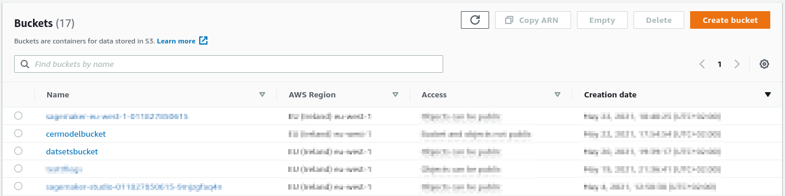

**Mask R-CNN training with docker containers on Sagemaker**

Mask R-CNN for metal casting defects detection and instance segmentation using Keras and TensorFlow.

This project was possible thanks to the repository [matterport/Mask_RCNN](https://github.com/matterport/Mask_RCNN), where we have adapted the code for instance segmentation written by matterport for work into a docker container and fine-tuned the pretrained model on COCO with our dataset, using Sagemaker.

- - -

# **Index**

<!-- START doctoc generated TOC please keep comment here to allow auto update -->
<!-- DON'T EDIT THIS SECTION, INSTEAD RE-RUN doctoc TO UPDATE -->
<!-- param::isNotitle::true:: -->

- [**Overview**](#overview)
- [**Project struscture**](#project-struscture)
- [**Dataset**](#dataset)
  - [**Original dataset**](#original-dataset)
  - [**Our dataset**](#our-dataset)
    - [**Mask images preparation**](#mask-images-preparation)
    - [**Json annotations preparation**](#json-annotations-preparation)
    - [**Augmentation**](#augmentation)
- [**Training on Sagemaker**](#training-on-sagemaker)
  - [Sagemaker overview](#sagemaker-overview)
  - [Use Sagemaker API](#use-sagemaker-api)
  - [Start a taining job from sagemaker a notebook](#start-a-taining-job-from-sagemaker-a-notebook)
    - [Preparation of the data on s3](#preparation-of-the-data-on-s3)
    - [Push the Docker image to ECR](#push-the-docker-image-to-ecr)
    - [start the training job](#start-the-training-job)
    - [Output and tensorboard data](#output-and-tensorboard-data)
  - [Passing more data to the container](#passing-more-data-to-the-container)
    - [hyperparameters](#hyperparameters)
    - [Environment](#environment)
- [**Results**](#results)
- [**Useful links**](#useful-links)
  - [AWS docs](#aws-docs)
  - [Sagemaker docs](#sagemaker-docs)
  - [Dataset](#dataset-1)
  - [Docker](#docker)
  - [Git reference](#git-reference)
  - [Useful articles](#useful-articles)
  - [Jupyter docs](#jupyter-docs)
  - [Related papers](#related-papers)

<!-- END doctoc generated TOC please keep comment here to allow auto update -->
- - -

# **Overview**

The core of the project was the matterport implementation of [Mask R-CNN](https://arxiv.org/pdf/1703.06870.pdf) an architecture proposed by Ross Girshick et al., revisited using [Feature pyramid network](https://arxiv.org/pdf/1612.03144.pdf) as final stage and using [Resnet101](https://arxiv.org/pdf/1512.03385.pdf) as backbone.

- - -

# **Project struscture**

In this section is shown the structure of the project and how each example is organized.

```plain
.
├── assets
├── Augmentation_notebooks
├── cudnn-10.0-linux-x64-v7.6.3.30
|
├── dataset_preparation_notebooks
│   ├── obj_class_to_machine_color.json
│   ├── sample_annotations
│   ├── sample_imgs
│   ├── sample_masks
│   ├── supervisely_json_dataset_preparation.ipynb
│   └── supervisely_mask_dataset_preparetion.ipynb
|
├── datasets
│   ├── cast_dataset
│   ├── cast_dataset_polish
│   ├── casting product image data for quality inspection
│   └── ISIC2018
|
├── Dockerfile_Local
├── docs
|
├── Mask_RCNN
│   ├── cast_debug.py
│   ├── cast_inference.py
│   ├── cast_sagemaker.py
│   ├── lesions.py
│   ├── lesions_sagemaker.py
│   ├── LICENSE
│   └── mrcnn
|
├── Model
|   └──
|
├── Sagemaker_cast_example
│   ├── cast_container_training.ipynb
│   ├── Docker_image_tf_aws
│   │   ├── build.sh
│   │   ├── docker-compose.yml
│   │   └── Dockerfile
│   └── Docker_image_tf_std
│       ├── build.sh
│       ├── docker-compose.yml
│       └── Dockerfile
|
├── Sagemaker_dummy_example
├── Sagemaker_dummy_example_2
├── Sagemaker_lesion_example
└── tools

```

- - -

# **Dataset**

## **Original dataset**

The original dataset is an image collection of one type of casted metal product done with similar angle of view and with the objects every in front view.
The dataset was divided only by defected and not defected object, in fact it is a dataset for only image classification.
It's composed by 781 objects with defects and 519 object without defects, the same images are available in two resolution 512x512 and 300x300.
the dataset it's available on kaggle at this [link](https://www.kaggle.com/ravirajsinh45/real-life-industrial-dataset-of-casting-product)


## **Our dataset**

Our dataset start from the precedent mentioned image classification dataset, in which we have added masks for the segmentation task. The dataset was done using [Supervisely](https://app.supervise.ly/) a powerfull tool for create your own 3D 2D datasets, for object detection, semantic and instance segmentation.
The original dataset was made by 1300 images, due to time constraints we have only annotated 238 images. In our dataset structure are present 4 classes [disk, hole, chipping, deburring], the first is present in every image of the dataset, the other three classes are preset only in images with defected disks.


(this image is only rappresentative then how classes are applied)

The dataset is released in [**supervisely format**](https://docs.supervise.ly/data-organization/00_ann_format_navi/04_supervisely_format_objects), where there is two way to extract objects bitmaps shown below.
The goal for the dataset preparation for training Mask R-CNN is to extract from the dataset for each image several masks, one for each istance of object that is present into this immage and that is labled. Each mask is a simple numpy array of bool or uint8 with shape (height, width), where the background is indicated with zero and the labeed region of our istance is marked with pixel of value 1.
At the end of the process we need to obtain for each image a numpy array with shape (height, width, n_inst) where n_inst is the number of instace of every class in the image and an array with shape (n_inst) that contains the class of each instance into the 3D array of masks.

### **Mask images preparation**

Notebook with code example: [**supervisely_mask_dataset_preparetion.ipynb**](dataset_preparation_notebooks/supervisely_mask_dataset_preparetion.ipynb)

The first way is to use the images into datasets/cast_dataset/masks_machine/ folder where each image have the same name of the original, but their color are mapped in different way, in this format each pixel represent a class, the associations between colors and classes can be found into the obj_class_to_machine_color.json file, presented below in json format.

```json
{
  "chipping":   [1, 1, 1],
  "deburring":  [2, 2, 2],
  "holes":      [3, 3, 3],
  "disk":       [4, 4, 4]
}
```

The image in this format isn't visible to human eye as can be seen below, but it is easy to manipulate with a simple script.
In this images it's shown as the istances appear completely black but if the small differences in the pixels are highlighted they beacame visibles.


All we need for start the process of instance separation is to extract from the mask, each pixel with the same value and place it in another blank image by changing the values of the class pixel to 255, The result will be n matrix for n class.
In this case in the original mask were only instances belonging to 2 classes so the generated mask for deburring and hole class are empty.
The next step is to separete all instances of each class, in the case of disk we have only one instance so the work is already done but in the chipping mask there are 11 instances so we need to calculate the position of each of that.


This step isn't too hard, if you use opencv there is an helpfull function that given one matrix 2D with 0 and 255 values, automaticaly separetes each contiguous regions,
giving helpfull information about each region ([connectedComponentsWithStats](https://docs.opencv.org/3.4/d3/dc0/group__imgproc__shape.html#ga107a78bf7cd25dec05fb4dfc5c9e765f)).
In the example below we can see as each detected region is marked with a cross, but it's important to note as in the disk mask was detected one more instace that shouldn't be here, maybe beacuse there is same disconnected pixel that was rilevated as another region so it's a good practice setting an area limit under which the region it's rejected. In the output of this function in addition to the center points of the regions, the areas of the regions there is one matrix with the same dimensions of the input matrix but this time the values of each region is marked with different values, similarly how the initial mask separete different classes.


The last step is similar to the first, where each class was sepatrated into multiple masks but at this point the only difference is that we're separating istances of the same class. So the last thing to do is to packing all this masks into one tensor with shape (h, w, n), and creating one vector of n elements where the classes of each mask are stored. Below are shown the result masks obtained from the chipping mask.


One last comment should be done about using this form of the dataset for the instace segmentation task, if the instaces of various objects are overlapped like in this case, this foramt shouldn't be used, due to the fact that mask like disk result dameged after the process of separation, how you can see there is some holes. It's better if the mask could be extracted and remains intact, so if you can use one dataset in another form it's even better. How is shown in the next section Supervisely present one form of dataset that is perfect to satisfy this need.

Notebook with code example: [**supervisely_mask_dataset_preparetion.ipynb**](dataset_preparation_notebooks/supervisely_mask_dataset_preparetion.ipynb)

### **Json annotations preparation**

Notebook with code example: [**supervisely_json_dataset_preparetion.ipynb**](dataset_preparation_notebooks/supervisely_json_dataset_preparation.ipynb)

Supervisely whene the dataset is exported give you the mask dataset shown above and another one in json format, which is more meaningfull. For each image is present into the ann/ folder the corresponding file with same name but with .json extension, so for the image cast_def_0_102.jpeg there will be the file cast_def_0_102.jpeg.json containing all the info related to this image, for example all its lables, who labled the image, the image tags and many other information. Let’s take a look at the most meaningfull part of this format and at the cast_def_0_102.jpeg.json file:

- **size**:         list of the mask dimensions
  - **height**:     height of the image
  - **width**:      width of the image
- **objects**:      list of all the image label objects
  - **geometryType**:   type of label es. bitmap or rectangle
  - **classTitle**: the name of the class, es. disk or hole in our case
  - **bitmap**:     bitmap object ! present only if the object is "geometryType":   "bitmap"
    - **data**:     compressed bitmap encoded in base 64 characters
    - **origi**:    array containing [x, y] coordinates of the top left corner of the bitmap into the mask

Here we can see the complete json with all the values, but not all the data are usefull for our scope, only the data shown above will be used from our algorithm for the mask recostruction, so the most important part it's the field "data" under "bitmap" that contain effectively the lable.

```json
{
  "description": "",
  "tags": [
    {
      "id": 105626860,
      "tagId": 29138031,
      "name": "bad",
      "value": null,
      "labelerLogin": "username",
      "createdAt": "2021-05-12T08:50:31.083Z",
      "updatedAt": "2021-05-12T08:50:31.083Z"
    }
  ],
  "size": {
    "height": 512,
    "width": 512
  },
  "objects": [
    {
      "id": 731743712,
      "classId": 2926797,
      "description": "",
      "geometryType": "bitmap",
      "labelerLogin": "max_svm",
      "createdAt": "2021-05-12T08:53:14.856Z",
      "updatedAt": "2021-05-15T17:03:22.089Z",
      "tags": [],
      "classTitle": "disk",
      "bitmap": {
        "data": "eJwBsgRN+4lQTkcNChoKAAAADUlIRFIAAAGIAAABkQEDAAAARVS2NgAAAAZQTFRFAAAA////pdmf3QAAAAF0Uk5TAEDm2GYAAARaSURBVHic7dxNjpwwEAXgjrKYpZUT+Cg+mjkaR+EILFmgdpJJM+Cfcr1XI1Ar3WxHn3D5lYnSYN9uzetXSmv7L8IV0p/rzoKUFhj8SI9rYkFKoPC7AKtPhwsalz8K6CYpuwYdfOQCuElI5E1+FkCvvbyF3iuxFNqwqkGpw/K1UPqxHpRSyI8apDT2hGuJmRyUMqwW6M5vY27/XhNZRrcbfVt0CgltIRfSTOPvNdNCLEQovFOIVIb83BKB1FpiGWLHy4MSSv8ZZSEU0hPNQoQ2/HfNtGgW0hXNQj66YmgI3xVTQ4SuaGXYF63Su6DVvp2u+rzq0vuT20q9P7mt1L0i6skKiqhL50VURD1ZGqgmS4uj7iwtjlpocdSBOFWUgXhVlN2rizKQqIpyqQOiiFAHRYR6gKXQAywj1AMshQNEHqEHRB5hAEQeYQREHiECMoHEkYeOiWOESIB5IEiA+Sp0kDhG6GkRILHS4hh6hET6lsDAIUIs8mOEvMCa5Bg61iQWsYfuQLF+Q3hQ7G0SaBFBsa90XqDgS6BNsrciL9C22gXaJHvz4mJrRXei2JrXw2I1iwCLZBbxTDGQrWsXeOturYi37taKVwi82bfmdaeKhWzdrXl5EZ5M3NlmNwsCPBYhLZjl8W9JnS1GcnlYxGQSzBK0iJlcghaxXCT8yWIlF+014k4u8/S5CK8QHDCIwSC4B4NFjAbBPRieVUzkw8ciZoNwbwFeC/lIfGWxGkQ4Xdzf4kSR2H8GX1qw4C3e4i3e4v8V9xcW8UXFahDhCcXysmI2CP8Wp4mJ/n/tFWI0CPa3jOcUg0Gwvy1dI9hf7tgXDZeIO/1L6lUiUmJ9WhGeTlzx/mM2CUeJ6SJx9nu10STOfgc5mMTzva/l3yJf8G6bf39+xVv91SjCqYL/koMXs1E4QkxGwTwaRloMn4JZ6FbBLMIbK7ZPGs8U29dtkRYBFotZeFjMD+FgMZkF3orjQ/BfZuJtMtDitl3nCf5r3P0b4UALD4rlG8KBYqbF9CXQxhq/BNpYu0DbZPgSaOg7AEM/7gUItPCQOO5QcJBYaDEfBL+bAwtkosV4EFiEmYiIOAIswkx4AOS7hBwg8p1IyApZvimQQOZMIIFMuYi6GHMRdDHQIgeGnXpOFeVuQH1NlTsO9QhnWhRxAKEXcQChD6WImiiBYSerV0S9tdgpopxcPcJycnVRTa4aYTW5aoQVMOypViLkd3rXU6UFUk+VZY97d7LaZyH0RPvQgdgR7YMNQkfMTeE6YmqKXme1pqo/WU3QK106msKLQjr1RC69PVW90ttTdeukPkoiSGKQhFi6BMRCOseRCKJz5Elsi1kWQiFi4eLKlYHQjN1zhJqie5ZOIAsXSp96oln62BOt0pWTiiJZRnNYQ1/Uw1KPT6rmVz1piz/UqYpdKeNWhQgc/1XMlj6oYljQoWTZTQZEHCMBDws71D5h4sbeYh/XjILbI3l0SNvIpBv8BgLHGhsJeoLmAAAAAElFTkSuQmCCYdYkJA==",
        "origin": [
          60,
          54
        ]
      }
    },
    {
        ...
    },
    ...
  ]
}
```

For achieve our goal, to obtain a tensor of masks for each object instace in the image, we have to decode each bitmap present into the json file. Each bitmap is a rectangular bool mask of arbitrary size that is obtained using the decode function shown below.

```python

decode function 
def base64_2_mask(s):
    z = zlib.decompress(base64.b64decode(s))
    n = np.frombuffer(z, np.uint8)
    #n = np.fromstring(z, np.uint8) #depecated
    mask = cv2.imdecode(n, cv2.IMREAD_UNCHANGED)[:, :, 3].astype(bool)
    return mask

encode function
def mask_2_base64(mask):
    img_pil = Image.fromarray(np.array(mask, dtype=np.uint8))
    img_pil.putpalette([0,0,0,255,255,255])
    bytes_io = io.BytesIO()
    img_pil.save(bytes_io, format='PNG', transparency=0, optimize=0)
    bytes = bytes_io.getvalue()
    return base64.b64encode(zlib.compress(bytes)).decode('utf-8')
```

The result of that function are masks with sizes determinated from the bitmaps size, this time you can see that all bitmap is intact, unlike the previous case is visible how the instance 1 wasn't degraded from the mask extraction, why in this format there isn't information loss differently from the dataset in one mask format where all this instaces were stacked in the same mask.


The last proces that we need to do for obtain our tensor is to create one blank tensor of masks, filled with only zeros, with size specified in the size field in the json and with the number of lables in the image, so we need to copy each bitmap on one mask using the origin field specified in each label object.
The origin field contains two values, the x y cordintes of the top left angle of the bitmap in the image using as origin (0, 0) the top left angle of the mask, so using this values as offset for the copy operations the results are our masks. Now we have only to generate one vector that store the classes of each mask in uint8 format, and with this function applied on each image we have the dataset ready to be used on the Mask R-CNN tranining.

The function described override the load_mask() function present in the Mask R-CNN framework.


Notebook with code example: [**supervisely_json_dataset_preparetion.ipynb**](dataset_preparation_notebooks/supervisely_json_dataset_preparation.ipynb)

### **Augmentation**

As we have already said, our dataset it's made by 238 images, 18 of which used for the validation-set so to enable the model to learn and limit the overfitting is needed a good augmentation. We start from the library used on the matterport/Mask_RCNN project [**imgaug**](https://github.com/aleju/imgaug), a powerfull library with a lot of functions usable for ugment images.
For chose the best functions for our task we have prepared some notebooks for test performance and result of imgaug functions, chosing the best parameters, below the links to this notebooks:

- [**aritmetic_augmentaton_notebook.ipynb**](Augmentation_notebooks/aritmetic_augmentaton_notebook.ipynb)
- [**blend_augmentation_notebook.ipynb**](Augmentation_notebooks/blend_augmentation_notebook.ipynb)
- [**blur_augmentation_notebook.ipynb**](Augmentation_notebooks/blur_augmentation_notebook.ipynb)
- [**collections_augmentation_notebook.ipynb**](Augmentation_notebooks/collections_augmentation_notebook.ipynb)
- [**color_augentation_notebook.ipynb**](Augmentation_notebooks/color_augentation_notebook.ipynb)
- [**contrast_augmentation_notebook.ipynb**](Augmentation_notebooks/convolutional_augmentation_notebook.ipynb)
- [**convolutional_augmentation_notebook.ipynb**](Augmentation_notebooks/contrast_augmentation_notebook.ipynb)
- [**geometric_augmentation_notebook.ipynb**](Augmentation_notebooks/geometric_augmentation_notebook.ipynb)
- [**imgcorruptlike_augmentation_notebook.ipynb**](Augmentation_notebooks/imgcorruptlike_augmentation_notebook.ipynb)
- [**pooling_augmentation_notebook.ipynb**](Augmentation_notebooks/pooling_augmentation_notebook.ipynb)

So after tried it we realized three presets in the augmentation_presets.py file, with each preset use more aggressive functions or applay the same more heavily. In the image below are shown 15x15 images of the dataset augmented with the preset 3, the heaviest.


- - -

# **Training on Sagemaker**

## Sagemaker overview

The following diagram shows how you train and deploy a model with Amazon SageMaker:


The area labeled SageMaker highlights the two components of SageMaker: model training and model deployment.

To train a model in SageMaker, you create a training job. The training job includes the following information:

- The URL of the Amazon Simple Storage Service (Amazon S3) bucket where you've stored the training data.

- The compute resources that you want SageMaker to use for model training. Compute resources are ML compute instances that are managed by SageMaker.

- The URL of the S3 bucket where you want to store the output of the job.

- The Amazon Elastic Container Registry path where the training code is stored.

You have the following options for a training algorithm:

- **Use an algorithm provided by SageMaker** — SageMaker provides training algorithms. If one of these meets your needs, it's a great out-of-the-box solution for quick model training.

- **Submit custom code to train with deep learning frameworks** — You can submit custom Python code that uses TensorFlow, PyTorch, or Apache MXNet for model training.

- **Use your own custom algorithms** — Put your code together as a Docker image and specify the registry path of the image in a SageMaker `CreateTrainingJob` API call.

We chose the latter approach, creating a docker image with the code and the requirements. This approch has the main advantage that with minimal modification to the code it can be runned as a standalone dockerfile. [#TODO espandere]

## Use Sagemaker API

An Amazon SageMaker notebook instance is a machine learning (ML) compute instance running the Jupyter Notebook App. SageMaker manages creating the instance and related resources. Use Jupyter notebooks in your notebook instance to prepare and process data, write code to train models, deploy models to SageMaker hosting, and test or validate your models. More examples can be found [here](https://docs.aws.amazon.com/sagemaker/latest/dg/howitworks-nbexamples.html).

The main advantage of using the notebook on Sagemaker is the preconfigured AWS cli, you can easily access resouces on S3 or download from internet at high speed.

If you already have the AWS cli configured on yout local machine you can run a notebook locally and remotely lauch the training on an ASW machine. To install the sagemaker sdk just  run `pip install -U sagemaker`, more info [here](https://aws.amazon.com/blogs/machine-learning/use-the-amazon-sagemaker-local-mode-to-train-on-your-notebook-instance/).

A difference between the notebook on sagemaker and the local one is the role, if you use sagemaker from within AWS the notebook can create a role and give himself access to all s3 buckets; on the other hand if you run the notebook locally you need to create a role and assign the appropriate permissions to it.
[#TODO @massi dagli un'occhiata]

## Start a taining job from sagemaker a notebook

First let's create a simple docker image like [this](Sagemaker_dummy_example/Dockerfile), the importante step are:

```Dockerfile
[...]
RUN pip3 install sagemaker-training

[...]
ENV SAGEMAKER_PROGRAM "train.py"
```

The `sagemaker-training` library is needed for sagemaker to interface within the docker; the `SAGEMAKER_PROGRAM` environment variable tell sagemaker wich script need to be executed for the training.

In this example the code parsed some fake hyperparameters and produced some fake chachpoints and tensorboard data.

The default paths are:

- `/opt/ml/output/data/`: the output data
- `/opt/ml/output/tensorboard/`: the tensorboard
- `/opt/ml/checkpoints/`: the checkpoints

The path structure of sagemaker is described [here](https://docs.aws.amazon.com/sagemaker/latest/dg/amazon-sagemaker-toolkits.html).

### Preparation of the data on s3

The training job will download the model and the dataset from s3, so we need to make some bucket and upload what is needed.

In our case we made two buckets, one for the datasets and one for the pretrained model:


We will nees the uri of those bucket later, they will look like:

```bash
dataset_bucket = "s3://datsetsbucket/{path_to_dataset}/"
model_bucket = 's3://cermodelbucket'
```

### Push the Docker image to ECR

Next you need to push it to an Amazon ECR repository, the docs for this step is [this](https://docs.aws.amazon.com/AmazonECR/latest/userguide/docker-push-ecr-image.html).

[#TODO massi!]

If the push was successful it should appear on the ECR web page like this:


### start the training job

Now we can launch a sagemaker notebook and start the docker we just pushed to ECR, we can either use the notebook on the AWS page or the local one.

The notebook we used in this  example is [this](Sagemaker_dummy_example/Dummy_spot_container_training.ipynb), more info is on the notebook.

The documentation of `sagemaker.estimator.Estimator` will be extesively treated on a following sectio [TODO link to section]

### Output and tensorboard data

During the execution of the container sagemaker will upload to s3 everithing in the tensorboard and checkpoint folder nearly in real time. This can be used to view the tensorboard data as the training proceed; and to save chachpoints of the model in case the training whould be interrupted. In that case the checkpoint folder will be redownloaded onto the new container but it need to be manually cheched at the start of the script.

When the container conclude it's work the content of `/opt/output/data/` will be uploaded in the bucket passed to the estimator, in our case it is `output_path = f's3://{sagemaker_default_bucket}/output'`.

## Passing more data to the container

[#TODO <https://github.com/aws/sagemaker-training-toolkit/blob/master/ENVIRONMENT_VARIABLES.md#sm_user_args> e come sono costruite sul notebook le variabili hiperparameters e environment]

[#TODO dummy example 2]

In the previous example we started the container passing some test data to it, in this example we will extend this part.

There are two metod to pass data inside the script, the `hyperparameters` and `environment`. Both are python dict passesed as argument to `sagemaker.estimator.Estimator` in the notebook.

### hyperparameters

In our case the hiperparameters on the notebook side are:

```python
hyperparameters = {
    "NAME": "cast", 
    "GPU_COUNT": 1, 
    "IMAGES_PER_GPU": 1,
    "AUG_PREST": 1,
    "TRAIN_SEQ": "[\
        {\"epochs\": 150, \"layers\": \"all\", \"lr\": 0.005 }\
    ]"
}

[...]

training_test = sagemaker.estimator.Estimator(
    [...]
    hyperparameters = hyperparameters,
    [...]
)
```

Tha syntax in the dict on the notebook is a bit tricky and prone to error because that dict will be converted to strings and than to json, be sure to do a little try and error.

In the train script we can retrieve those from the environment variable `SM_HPS`:

```python
hyperparameters = json.loads(read_env_var('SM_HPS', {}))
```

That lead to:

```python
>>> print(type(hyperparameters))
<class 'dict'>

>>> print(hyperparameters)
{'NAME': 'cast', 'GPU_COUNT': 1, 'IMAGES_PER_GPU': 1, 'AUG_PREST': 1, 'TRAIN_SEQ': [{'epochs': 150, 'layers': 'all', 'lr': 0.005}]}
```

This way we can pass every config (and more) as hyperparameters.

### Environment

We also used the `environment` parameter to pass the paths of the checkpoints and tensorboard data, on the notebook side we have:

```python
user_defined_env_vars = {"checkpoints": "/opt/ml/checkpoints",
                        "tensorboard": "/opt/ml/output/tensorboard"}

training_test = sagemaker.estimator.Estimator(
    [...]
    environment = user_defined_env_vars,
    [...]
)
```

And on the train script we read those as environment variables:

```python
# default values
user_defined_env_vars = {"checkpoints": "/opt/ml/checkpoints",
                         "tensorboard": "/opt/ml/output/tensorboard"}

CHECKPOINTS_DIR = read_env_var("checkpoints", user_defined_env_vars["checkpoints"])
TENSORBOARD_DIR = read_env_var("tensorboard", user_defined_env_vars["tensorboard"])
```

The default values are coherent with the default paths used by sagemaker. [#TODO link to docs]


- - -

# **Results**

- - -

# **Useful links**

## AWS docs

- [AWS cli configuration](https://docs.aws.amazon.com/cli/latest/userguide/cli-chap-configure.html)
  
- [Docker ECR credentials configuration](https://docs.aws.amazon.com/AmazonECR/latest/userguide/common-errors-docker.html)
  
- [Pushing Docker image to ECR](https://docs.aws.amazon.com/AmazonECR/latest/userguide/docker-push-ecr-image.html)

- [EC2 instance types](https://aws.amazon.com/it/ec2/instance-types/)

## Sagemaker docs

- [Sagemaker pricing](https://aws.amazon.com/sagemaker/pricing/)

- [Estimator reference](https://sagemaker.readthedocs.io/en/stable/api/training/estimators.html)

- [Sagemaker API reference](https://sagemaker.readthedocs.io/en/stable/api/training/estimators.html)

- [Sagemaker toolkits containers structure](https://docs.aws.amazon.com/sagemaker/latest/dg/amazon-sagemaker-toolkits.html)

- [Git of sagemaker training toolkit](https://github.com/aws/sagemaker-training-toolkit)

- [Git of sagemaker python SDK](https://github.com/aws/sagemaker-python-sdk)

- [Sagemaker practical reference](https://sagemaker.readthedocs.io/en/stable/overview.html)

- [Using Docker containers with SageMaker](https://docs.aws.amazon.com/sagemaker/latest/dg/docker-containers.html)

- [Use Checkpoints in Amazon SageMaker](https://docs.aws.amazon.com/sagemaker/latest/dg/model-checkpoints.html)

- [Adapting Your Own Training Container](https://docs.aws.amazon.com/sagemaker/latest/dg/adapt-training-container.html)

- [Sagemaker environment variables](https://github.com/aws/sagemaker-training-toolkit/blob/master/ENVIRONMENT_VARIABLES.md)

## Dataset

- [Supervisely format objects](https://docs.supervise.ly/data-organization/00_ann_format_navi/04_supervisely_format_objects)

- [dataset annotation tool](https://supervise.ly/)

- [DTL (data trasformation lenguage) docs](https://docs.supervise.ly/data-manipulation/index)

- [project dataset](https://www.kaggle.com/ravirajsinh45/real-life-industrial-dataset-of-casting-product)

- [configure kaggle apis](https://adityashrm21.github.io/Setting-Up-Kaggle/)

## Docker

- [Deep-learining-containers](https://github.com/aws/deep-learning-containers/blob/master/available_images.md)

## Git reference

- [matterport/Mask_RCNN](https://github.com/matterport/Mask_RCNN)

- [aws/amazon-sagemaker-examples/advanced-functionality/custom-training-container](https://github.com/aws/amazon-sagemaker-examples/tree/master/advanced_functionality/custom-training-containers/script-mode-container)

- [svpino/tensorflow-object-detection-sagemaker](https://github.com/svpino/tensorflow-object-detection-sagemaker)

- [roccopietrini/TFSagemakerDetection](https://github.com/roccopietrini/TFSagemakerDetection)

- [shashankprasanna/sagemaker-spot-training](https://github.com/shashankprasanna/sagemaker-spot-training)

## Useful articles

- [guide to using Spot instances with Amazon SageMaker](https://towardsdatascience.com/a-quick-guide-to-using-spot-instances-with-amazon-sagemaker-b9cfb3a44a68)

## Jupyter docs

- [magic commands](https://ipython.readthedocs.io/en/stable/interactive/magics.html#)

## Related papers

- [Mask R-CNN paper](https://arxiv.org/pdf/1703.06870.pdf)

- [Feature pyramid network paper](https://arxiv.org/pdf/1612.03144.pdf)

- [resnet50 paper](https://arxiv.org/pdf/1512.03385.pdf)
